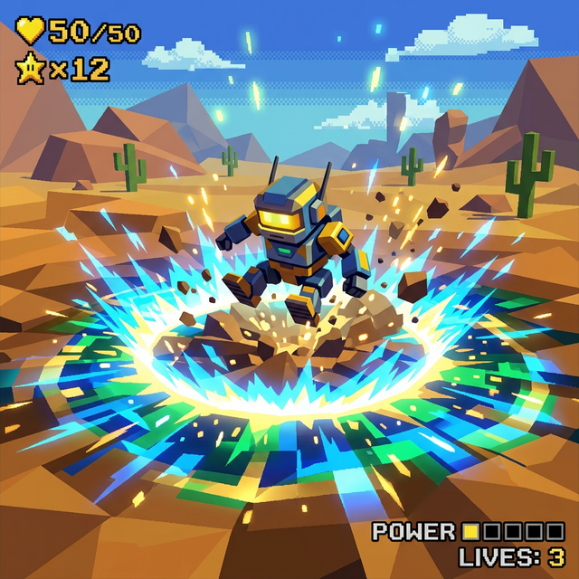
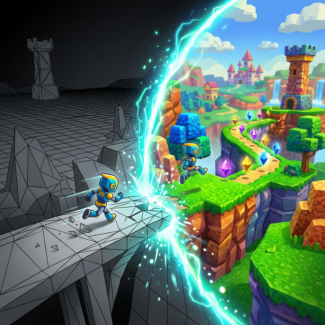
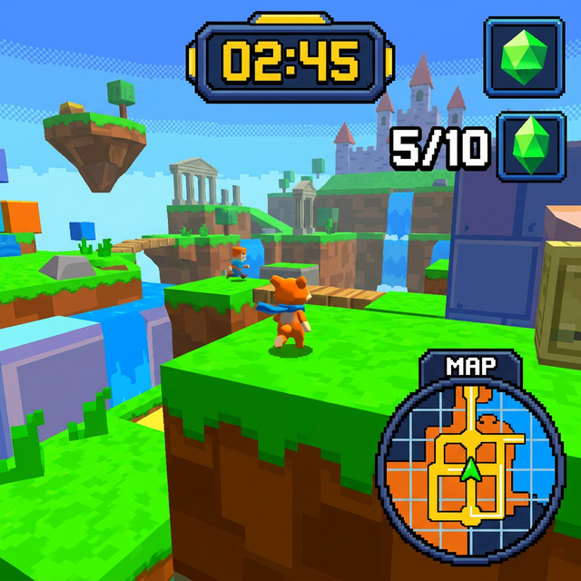

# Documento de Concepto (Pitch Document)
## Título Provisional
**"Eco-Scanner 64"**

## El Concepto Principal (High Concept)
Eres un pequeño y simpático robot de exploración enviado a un planeta desolado que ha perdido todo su color y forma, reduciéndose a ser un páramo geométrico "wireframe" (compuesto sólo por líneas abstractas grises). Tu misión es **"rebotar"** datos sobre el entorno para reconstruirlo gradualmente, devolviéndole la vida, la textura y el color de un mundo vibrante.

## La Temática: Arqueología Digital
En lugar de rescatar a una princesa o vencer a un villano genérico, tu objetivo es recuperar la memoria de una civilización perdida. El mundo es un desierto digital geométrico que reacciona y cobra vida interactiva de manera permanente conforme el jugador lo explora y activa sus sistemas latentes.

## Mecánicas Principales (Estilo Retro 3D - N64)
* **El Salto de Pulso (Ground Pound):** Al saltar y caer con peso al suelo, el robot protagonista emite una onda de choque expansiva geométrica. Al impactar, esta energía "pinta" y rellena los polígonos cercanos, revelando caminos ocultos, activando plataformas y resolviendo puzles de entorno.

* **La Transformación del Mundo:** El juego se basa en el contraste estético y jugable. Las zonas no exploradas son una cuadrícula de wireframe inerte y peligrosa. Al usar el salto de pulso, el área se activa y se transforma visualmente a un mundo retro 3D (texturas pixeladas, colores vibrantes de estilo Nintendo 64).

* **Coleccionables con Sentido:** Los objetos a recolectar son "Fragmentos de Textura", con forma de cristales flotantes. Al conseguir un número determinado, el nivel o bioma cambia de fase de forma permanente o desbloquea nuevas mecánicas de entorno.

* **Movimiento Inercial:** Dado el tamaño y forma esférica del robot protagónico, el movimiento se basa en un sistema de físicas de rodamiento con inercia. Combinado con saltos libres ágiles, remite al "gamefeel" clásico de juegos de plataformas y puzzles de finales de los 90.

* **La Interfaz (HUD):** Mantendrá un estilo retro, contando la cantidad de Fragmentos recolectados y mostrando un minimapa para visualizar qué secciones del nivel ya han sido "reconstruidas" y cuáles siguen en gris.

